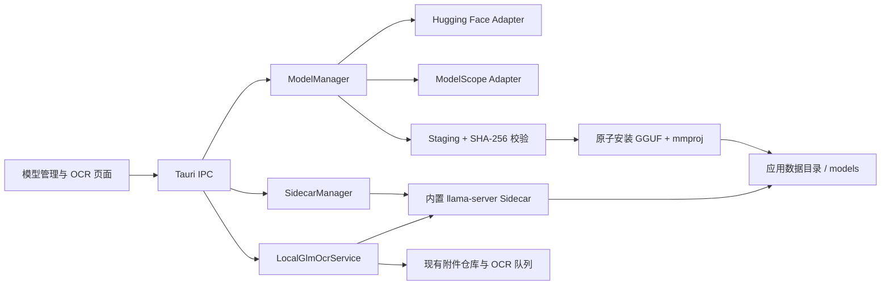

# GLM-OCR 内置 Sidecar 与模型下载设计

**状态：Proposed**

## 1. 目标与边界

Quiz Studio 直接内置可启动、停止和更新的 llama.cpp 推理 sidecar，但不把 GLM-OCR 权重放进安装包。用户在设置页选择 Hugging Face 或魔搭社区下载固定哈希的 GGUF 模型；下载完成后无需安装 Python、Ollama 或其他系统依赖即可离线 OCR。

首个实现目标为 Windows x64，接口和目录布局同时为 macOS Apple Silicon、Linux x64 预留。CPU-only 设备必须可运行；可用的 NVIDIA、Metal 或其他受运行时支持的加速设备由运行时自动选择。首版使用整页 GLM-OCR 推理并复用现有 PDF 分页、OCR 队列、附件仓库和校正工作台，不在同一里程碑内打包 PP-DocLayout-V3/PyTorch 版面流水线。

不在本阶段实现：任意第三方模型仓库、训练/微调、模型文件编辑、后台静默下载、局域网服务暴露，以及自动替换用户当前可用模型。

## 2. 方案比较

| 方案 | 优点 | 主要问题 | 结论 |
|---|---|---|---|
| 直接内置 llama.cpp | 已原生支持 GLM-OCR、视觉 mtmd 与 GGUF；CPU/GPU 跨平台；组件和故障面最少 | 需要固定 GGUF 与 mmproj；首版没有官方 SDK 的两阶段版面分析 | **采用** |
| 内置 Ollama 运行时 | CPU 友好且服务 API 成熟 | 重复应用已有的下载、模型和生命周期管理，多一层服务/runner 抽象 | 不采用 |
| 内置 Python + Transformers/PyTorch | 直接消费 Hugging Face/魔搭权重；最接近官方 SDK | Python、Torch、Transformers、CUDA/Metal 组合庞大；平台矩阵和依赖冲突难维护 | 不采用 |
| 内置 vLLM/SGLang | GPU 吞吐高，适合服务器 | Windows/CPU 桌面体验差，运行时与 CUDA 体积大 | 仅保留远程 Provider 支持 |
| 要求用户安装 Ollama/SDK | 应用包最小 | 不符合开箱即用；版本、端口和卸载不可控 | 继续作为高级外部 Provider，不作为默认本地方案 |

llama.cpp 已于 2026-02-18 合并 GLM-OCR 支持，包括 HF→GGUF 转换、GLM4/MTP 文本层和视觉 `mtmd`。`ggml-org/GLM-OCR-GGUF` 当前提供约 950 MB 的 Q8 主模型、约 484 MB 的 Q8 视觉 mmproj，以及约 1.79 GB 的 F16 主模型。首版默认 Q8 主模型与 mmproj，合计约 1.44 GB。

## 3. 总体架构



Tauri 主进程是唯一控制面。前端不获得 shell 权限，也不直接访问模型站 URL。Rust 负责下载、校验、原子安装、进程生命周期和本地 HTTP 调用。

安装包包含：

- 固定 llama.cpp 提交构建的平台匹配 `llama-server` 及所需动态库；
- 一份固定版本、签名随应用发布的模型清单；
- 第三方许可证和 NOTICE；
- 不包含任何 GLM-OCR 权重。

Tauri 使用 `externalBin` 打包 `llama-server`，平台运行库通过 `resources` 打包。文件按 target triple 构建，首批为 `x86_64-pc-windows-msvc`。Rust 主进程直接管理它，不在系统中注册服务，也不安装第二个桌面程序。

## 4. 模型清单与下载

应用只允许下载内置清单声明的官方模型。清单示例：

```json
{
  "schemaVersion": 1,
  "modelId": "glm-ocr-q8",
  "runtime": "llama.cpp",
  "runtimeConstraint": ">=0.x <1.0",
  "files": [
    { "path": "GLM-OCR-Q8_0.gguf", "sha256": "f589...819f", "size": 950433408 },
    { "path": "mmproj-GLM-OCR-Q8_0.gguf", "sha256": "e142...e5a5", "size": 484403648 }
  ],
  "sources": {
    "huggingFace": { "repo": "ggml-org/GLM-OCR-GGUF", "revision": "65a42de1..." },
    "modelScope": { "repo": "QuizStudio/GLM-OCR-GGUF", "revision": "<pinned>" }
  }
}
```

魔搭官方 `ZhipuAI/GLM-OCR` 当前提供 Safetensors，而 llama.cpp 运行 GGUF。应用不在用户机器上执行 Python 转换；发布流程把同一组已验证 GGUF 制品镜像到 Quiz Studio 的魔搭仓库。构建脚本必须确认两个源 SHA-256 完全一致，再生成应用内清单。下载源不是信任根，内置哈希才是。

下载流程：

1. 检测磁盘空间，至少保留“未完成文件剩余大小 + 512 MiB”；
2. 在 `downloads/<job-id>/` 写入 `.part` 文件和检查点；
3. 使用 HTTP `Range`、`ETag`/`Last-Modified` 断点续传；每次只并发 2 个文件；
4. 文件完成后流式计算 SHA-256，失败则保留可重试状态但不进入安装目录；
5. 全部文件通过后原子重命名为 staging 完成态；
6. 将主模型、mmproj 与安装清单原子重命名到版本目录；
7. 用该版本启动 `llama-server`，健康检查和最小图片 smoke test 成功后原子切换 `current.json`；
8. 保留前一个可用版本直到新版本验证完成，再按空间策略清理。

用户可暂停、继续、取消、修复和删除。自动源切换仅在网络错误时发生，并且最终哈希必须匹配；哈希不匹配立即停止，不尝试“接受镜像版本”。

## 5. 本地目录与持久化状态

```text
app_data/
├─ quiz-studio.sqlite3
├─ assets/                         # 现有题库/OCR 附件
├─ ocr-runtime/
│  ├─ current.json                 # 运行时版本与平台
│  └─ logs/
├─ models/
│  └─ glm-ocr/<version>/           # 主 GGUF、mmproj 与 install.json
└─ downloads/
   └─ <job-id>/                    # 可恢复暂存；完成后清理
```

新增 SQLite 聚合：

- `model_installations`：model_id、revision、source、状态、大小、安装时间、最后校验时间、错误；
- `model_download_jobs`：job_id、model_id、文件、已下载字节、ETag、状态、重试次数；
- `runtime_state`：runtime/version/platform、上次健康检查、上次崩溃原因。

下载状态机为 `planned → downloading → paused → verifying → installing → ready`，任一步可进入 `failed`；用户删除进入 `removing`。应用异常退出后，`downloading/verifying/installing` 根据磁盘事实重新归一化，不能只相信数据库状态。

## 6. Sidecar 生命周期与协议

`SidecarManager` 按需启动运行时，而不是随应用常驻：

1. OCR 页面选择“本地 GLM-OCR”或队列开始时请求 lease；
2. 在回环地址选择空闲随机端口，构造固定参数：`-m <model> --mmproj <mmproj> --host 127.0.0.1 --port <port>`；
3. 启动固定提交构建的 `llama-server`，轮询健康接口，最长等待 60 秒；
4. 首次加载模型单独显示“模型加载中”，不能伪装成下载或卡死；
5. 所有 lease 释放且空闲 5 分钟后优雅停止；应用退出时终止整个进程树；
6. 非用户取消的崩溃最多自动重启 2 次，指数退避，之后向队列返回可重试错误。

Rust 的 `LocalGlmOcrService` 调用 llama.cpp OpenAI-compatible 多模态端点，使用 GLM-OCR 官方建议的专用 OCR prompt，向现有 `OcrResult` 输出 Markdown、原始 JSON、耗时和警告。现有队列任务 ID 继续承担取消语义；取消时先取消 HTTP 请求，再在没有其他 lease 时停止 sidecar。

远程 `glm_sdk` / OpenAI-compatible Provider 保持不变。本地 sidecar 是一种新的受管 Provider：用户可以在本地、远程和基础 Tesseract 之间明确切换。

## 7. UI 与用户体验

设置页新增“本地 GLM-OCR”卡片：

- 运行时：已内置 / 不兼容 / 损坏；
- 模型：未安装 / 下载中 / 校验中 / 安装中 / 可用 / 需修复；
- 下载源：自动、Hugging Face、魔搭；中国大陆默认建议魔搭，但不静默替用户选择；
- 展示精确下载大小、预计临时空间、最终占用和当前速度；
- 操作：下载、暂停、继续、取消、校验修复、删除模型；
- 更新：显示新版本说明与额外下载量，必须由用户确认；旧模型在新模型 smoke test 通过前保持可用。

OCR 页面在模型未安装时提供“前往下载”，在运行时不兼容时继续允许 Tesseract 和远程 Provider，不阻塞题库其他功能。

## 8. 安全、隐私与供应链

- sidecar 只绑定 `127.0.0.1` 随机端口，不监听局域网；前端不直接获知启动命令；
- 所有下载目标由应用内清单生成，拒绝路径穿越、符号链接和任意 URL；
- 单文件和总大小有上限，下载前后均校验；
- 模型以固定 revision 和 SHA-256 信任，HTTPS 只是传输保护；
- 不启用 `trust_remote_code`，只接受运行时已支持的 `glm_ocr` 架构；
- 日志默认不写原图、API Key、完整本地路径或 OCR 正文；
- 模型删除不触碰 `assets/`、SQLite 题库和已完成 OCR 结果；
- 分发 llama.cpp、GLM-OCR GGUF 和相关组件时附带各自许可证、源码提交和版本清单。

## 9. 故障处理与验收

| 故障 | 行为 |
|---|---|
| 下载断网 | 保留 `.part` 和检查点，恢复后 Range 续传 |
| 镜像文件不同 | SHA-256 失败并停止安装，不自动放行 |
| 磁盘不足 | 下载前阻止；中途不足保留可清理暂存提示 |
| 安装失败 | 保留已验证 staging，允许只重试原子安装 |
| 端口冲突 | 重新选择随机端口，不杀其他进程 |
| sidecar 崩溃 | 当前页失败可重试；有限次数重启；已完成页不重跑 |
| GPU 不兼容/OOM | 释放模型并提示切 CPU；不清除队列和答案 |
| 应用升级中断 | 新旧运行时/模型采用版本目录和原子 current 指针 |

自动化验收至少覆盖：源 URL 解析、Range 续传、哈希不符、磁盘不足、路径越界、状态恢复、原子安装、进程启动/超时/崩溃/取消、模型删除隔离、旧数据库迁移。集成测试使用小型假模型和假 HTTP Server；真实约 1.44 GB 的 Q8+mmproj 只进入手工与发布候选验证，不进入普通 CI。

## 10. 分阶段实现

1. **组件管理基础**：模型清单、SQLite 状态、双源下载、续传、校验、设置页；先用小 fixture 验证。
2. **运行时管理**：固定 llama.cpp 提交并构建 Windows x64 `llama-server`，实现随机端口、健康检查、日志和进程树清理。
3. **模型安装**：下载 Q8 主 GGUF 与 mmproj，执行 smoke test、原子切换、修复与删除。
4. **OCR 接入**：新增本地受管 Provider，接入现有多页队列、取消、附件和校正工作台。
5. **平台扩展**：macOS arm64、Linux x64；建立每平台运行时制品与签名流水线。
6. **可选版面增强**：评估 PP-DocLayout 的 ONNX/独立组件方案；不把 Python/Torch 强塞回基础安装包。

## 11. 参考资料

- [GLM-OCR 官方仓库](https://github.com/zai-org/GLM-OCR)
- [GLM-OCR Hugging Face 模型](https://huggingface.co/zai-org/GLM-OCR)
- [GLM-OCR 魔搭模型](https://modelscope.cn/models/ZhipuAI/GLM-OCR)
- [llama.cpp 合并 GLM-OCR 支持](https://github.com/ggml-org/llama.cpp/pull/19677)
- [GLM-OCR GGUF](https://huggingface.co/ggml-org/GLM-OCR-GGUF)
- [Tauri 2 Sidecar 文档](https://v2.tauri.app/develop/sidecar/)
